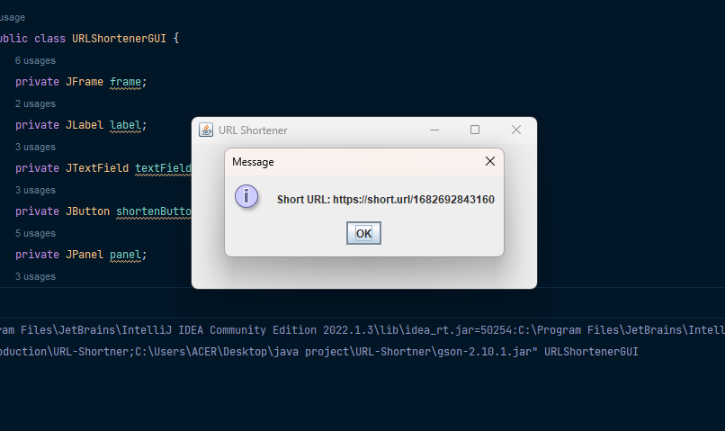

<!DOCTYPE html>
<html>
<head>
	<meta charset="UTF-8">
	
</head>
<body>
	<h1>URL Shortener</h1>
	
This is a simple URL shortener application that allows you to shorten long URLs into short, easy-to-share links.

	<h2>Screenshots</h2>
	
Here are some screenshots of the application:

	
	
	<h2>Usage</h2>
	
To use this application, simply enter a long URL into the input field and click the "Shorten" button. The application will generate a short URL that you can copy and share.

	<h2>Installation</h2>
	
To install and run this application, follow these steps:

	<ol>
		<li>Clone this repository to your local machine.</li>
		<li>Open the project in your IDE of choice.</li>
		<li>Compile and run the main class, URLShortenerFrame.</li>
	</ol>
	<h2>Dependencies</h2>
	<ul>
		<li>Java 8 or higher</li>
		<li>Google Gson library</li>
	</ul>
	<h2>License</h2>
	
This project is licensed under the MIT License. See the <a href="LICENSE">LICENSE</a> file for details.

</body>
</html>

